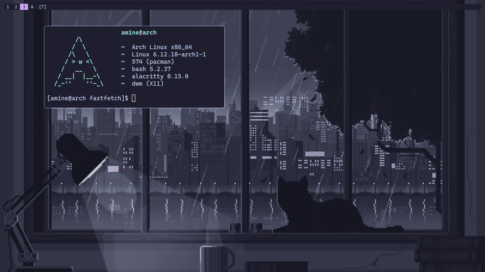

# dotfiles

## Tools
- **Terminal**: [alacritty](https://github.com/alacritty/alacritty)
- **Fetch**: [fastfetch](https://github.com/fastfetch-cli/fastfetch)
- **Window Manager**: [dwm](https://dwm.suckless.org)
- **Bar**: Built-in
- **App Launcher**: [dmenu](https://tools.suckless.org/dmenu)
- **Status**: [slstatus](https://tools.suckless.org/slstatus)
- **Font**: [CaskaydiaCove Nerd Font Mono](https://github.com/ryanoasis/nerd-fonts)
- **Theme**: [Catppuccin](https://catppuccin.com/)
- **GTK Theme**: [Fausto Korpsvart](https://github.com/Fausto-Korpsvart/Catppuccin-GTK-Theme)
- **ICONS Theme**: [Catppuccin Papirus Folders](https://github.com/catppuccin/papirus-folders)
- **CURSOR Theme**: [Catppuccin Cursors](https://github.com/catppuccin/cursors)

## Screenshots

